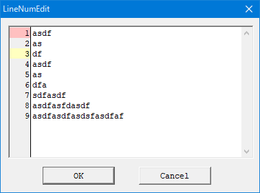

# LineNumEdit by katahiromz

LineNumEdit is a C++/Win32 library that implements "textbox with line numbers".



- Fully compatible to the Win32 EDIT control.
- Easily usable in C++.
- DLL and static supported.
- Under MIT license.

## How to use this library?

As static:

```c
#define LINENUMEDIT_IMPL
#include "LineNumEdit.hpp"
...
LineNumEdit::SuperclassWindow(); // Initialize the library
```

And create the `"LineNumEdit"` window by `CreateWindow`/`CreateWindowEx` function.
You can also use this window class in your dialog boxes.

As a DLL:

```c
LoadLibraryA("LineNumEdit");
```

And create the `"LineNumEdit"` window.

## Messages

### `LNEM_SETLINENUMFORMAT` message

Specifies the format of the line number label. For example, it's `TEXT("%d")`.

- `wParam`: Ignored.
- `lParam`: The format of `LPCTSTR`.
- Return value: zero.

### `LNEM_SETNUMOFDIGITS` message

Sets the number of digits to indicate the width of the column.

- `wParam`: The number of digits.
- `lParam`: Ignored.
- Return value: zero.

### `LNEM_SETLINEMARK` message

Sets the color of the line label.

- `wParam`: The line number to set a mark.
- `lParam`: The `COLORREF` value. Use `RGB` macro to set this.
- Return value: zero.

### `LNEM_CLEARLINEMARKS` message

Clears the color settings.

- `wParam`: Ignored.
- `lParam`: Ignored.
- Return value: zero.

### `LNEM_SETLINEDELTA` message

Specifies the line number of the top line.

- `wParam`: The line number.
- `lParam`: Ignored.
- Return value: zero.

### `LNEM_SETCOLUMNWIDTH` message

Sets the width of the column.

- `wParam`: The width of the column, in pixels.
- `lParam`: Ignored.
- Return value: zero.

### `LNEM_GETCOLUMNWIDTH` message

- `wParam`: Ignored.
- `lParam`: Ignored.
- Return value: The column width in pixels.

### `LNEM_GETLINEMARK` message

- `wParam`: The line number.
- `lParam`: Ignored.
- Return value: The `COLORREF` value or `CLR_INVALID`.

## Contact us

Katayama Hirofumi MZ katayama.hirofumi.mz@gmail.com
